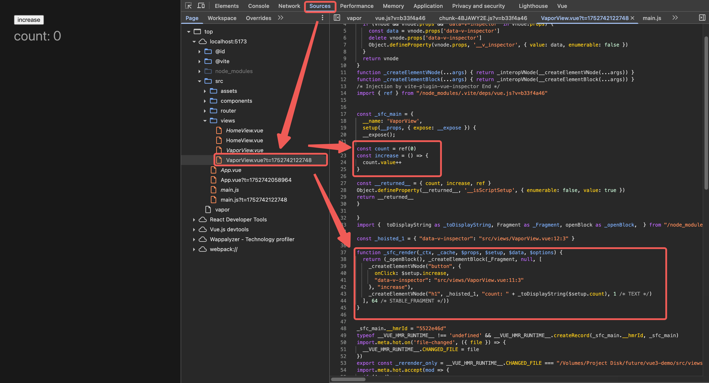

# vue vapor 初探

## vapor是什么

尤雨溪在VueConf 2025中说到，Vapor Mode是**一个为了极致性能而存在的全新的编译和渲染模式**。

简单来说是在vue3的基础上做了减法，去掉了diff的过程，页面更新的内容直接渲染出来。也就是我们常说的，无虚拟dom版本的vue。

## 怎么用

1. 安装最新版本的vue pre-release版本 `pnpm install vue@3.6.0-alpha.1`

2. 在项目中启用vapor mode

   1. 全局启用：如果想创建一个纯vapor的vue，在main.js中通过createVaporApp创建app，同时根组件App.vue中需要使用在script上加上vapor（这里有个bug，不知为何无法在这种情况下在main.js中开启router和pinia，会报错）

      ```javascript
      // main.js
      import { createVaporApp } from 'vue'
      
      const app = createVaporApp(App)
      app.mount('#app')
      
      // App.vue
      <script setup vapor>
        ...
      </script>
      ```

   2. 局部启用：在main.js中使用createApp创建app，且引入vaporInteropPlugin插件进行use注册，这样项目中的文件既可以是普通setup的vue文件，也可以是开启了vapor的vue文件

      ``` javascript
      // main.js
      import { createApp, vaporInteropPlugin } from 'vue'
      
      const app = createApp(App)
      app.use(vaporInteropPlugin)
      app.mount('#app')
      
      // 任意组件可开启vapor
      <script setup vapor>
        ...
      </script>
      ```

      

## 差异对比

对于同一段vue组件：

``` vue
<script setup>
import { ref } from 'vue'

const count = ref(0)
const increase = () => {
  count.value++
}
</script>

<template>
  <button @click="increase">increase</button>
  <h1>count: {{ count }}</h1>
</template>
```

在编译之后，未开启vapor模式下，可以明显的看到使用了createElementVNode函数来创建了VNode，也就是虚拟DOM



而在vapor模式下，没有创建虚拟DOM的过程


实现原理：

在vue3 vapor相关代码中中有个底层函数renderEffect，它是继承了vue3底层响应式对象ReactiveEffect，而ReactiveEffect的作用就是监听内部响应式数据变化后，执行更新函数。

在这个场景下可以理解为

1. vue3创建了响应式对象count
2. 将更新函数（更新页面dom元素）放到renderEffect函数中
3. 更新函数中用到了响应式对象count
4. 当响应式对象count值变化时，执行更新函数，即直接更新dom


## 特点

* 无虚拟DOM
* 提升性能
* 减少包体积，比如少了diff


## 适用场景

#### **虚拟 DOM 更适合**：

1. **复杂动态应用**
   - 需要频繁操作 DOM 结构（如动态表单、拖拽排序）
2. **兼容性要求高的项目**
   - 需要支持旧浏览器或第三方库（如基于虚拟 DOM 的组件库）。
3. **开发体验优先**
   - 虚拟 DOM 的声明式编程更易维护（"状态驱动 UI"）。

#### **Vapor 模式更适合**：

1. **性能敏感型页面**
   - 高频更新场景（如实时图表、股票行情）。
   - 内存受限环境（移动端、低配设备）。
2. **静态/简单交互页面**
   - 内容为主的页面（博客、文档站）。
   - 交互简单的列表/表格（直接 DOM 操作更高效）。
3. **极致轻量化需求**
   - 追求首屏加载速度（如营销落地页）。
   - 微前端子应用需减少运行时体积。

## 

